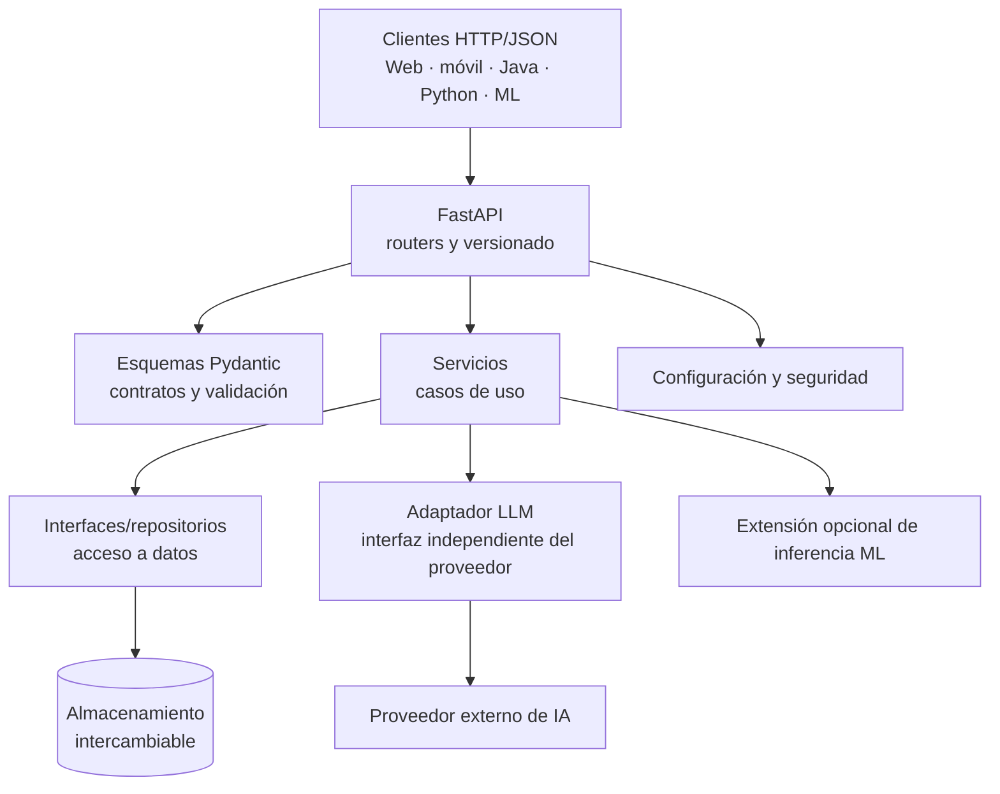

# Arquitectura inicial

## 1. Estilo arquitectónico

La primera versión será un **monolito modular**: una sola aplicación desplegable, organizada en módulos con responsabilidades claras. No se dividirá prematuramente en microservicios.

El objetivo es que la API pueda crecer sin acoplar sus rutas HTTP a la lógica de negocio, al mecanismo de persistencia ni al proveedor de IA.

## 2. Vista de alto nivel

Esta figura es conceptual; no representa módulos ya implementados.

## 3. Responsabilidades por capa

### Capa HTTP: `api/`

- Declara rutas, métodos HTTP, parámetros y códigos de respuesta.
- Agrupa rutas por dominio mediante routers.
- Mantiene el versionado público, inicialmente `/api/v1`.
- Traduce solicitudes HTTP en llamadas a casos de uso.
- No debe contener lógica de negocio extensa ni acceder directamente a la base de datos.

### Contratos: `schemas/`

- Define modelos de solicitud y respuesta con Pydantic.
- Expresa campos obligatorios, opcionales, límites y formatos.
- Evita devolver objetos internos arbitrarios como contrato público.
- No almacena secretos ni realiza llamadas externas.

### Lógica de negocio: `services/`

- Implementa casos de uso y reglas de negocio.
- Coordina repositorios y adaptadores.
- Puede probarse sin iniciar un servidor HTTP.
- No debe depender directamente de un framework web cuando una abstracción sencilla sea suficiente.

### Persistencia: `repositories/`

- Define cómo se consulta o modifica el estado persistente.
- La implementación en memoria, si se usa para la fase didáctica, será una implementación temporal.
- El servicio no debe depender de detalles específicos de una base de datos.
- La persistencia duradera y sus migraciones quedan para una etapa posterior.

### Integraciones externas: `integrations/`

- Encapsula las llamadas HTTP o SDK a proveedores externos.
- Define una frontera estable para el proveedor LLM.
- Configura timeout y tratamiento de errores de red.
- Evita que los nombres de modelos, esquemas de SDK o formatos internos del proveedor se filtren innecesariamente al contrato público.

### Configuración y seguridad: `core/`

- Centraliza configuración a partir de variables de entorno.
- Distingue configuración local de secretos.
- Aloja dependencias comunes de seguridad cuando se implementen.
- No debe incluir claves reales en código, ejemplos ni logs.

### Extensión de Machine Learning: `ml/` (futura y opcional)

- Podrá cargar artefactos de modelos existentes y exponer inferencia.
- Mantendrá separadas las dependencias pesadas de ML de los módulos básicos de la API cuando sea viable.
- No forma parte de la implementación de la sección 1.

## 4. Flujo de una solicitud

1. Un consumidor envía una solicitud HTTP/JSON.
2. FastAPI identifica la ruta y procesa parámetros y dependencias.
3. Pydantic valida la estructura de entrada.
4. El router delega el caso de uso a un servicio.
5. El servicio usa un repositorio o adaptador externo según sea necesario.
6. El resultado se convierte a un esquema de respuesta documentado.
7. La API devuelve el código HTTP y el cuerpo definidos en el contrato.

## 5. Decisión sobre LLM

El proveedor todavía no está seleccionado. El diseño debe permitir elegirlo desde configuración, pero la selección real se pospone hasta la etapa de integración.

La clave del proveedor se mantendrá en el backend. No se enviará al navegador, a aplicaciones móviles ni a los clientes que consuman esta API. La autenticación de los consumidores de nuestra API es una responsabilidad independiente de la credencial del proveedor.

## 6. Errores y contratos

- Los errores de validación se expondrán mediante respuestas coherentes con FastAPI y su contrato OpenAPI.
- Los recursos inexistentes devolverán `404` cuando aplique.
- Los errores de autenticación y autorización se distinguirán (`401` y `403`).
- Los conflictos del estado del recurso podrán usar `409`.
- Los fallos inesperados no expondrán trazas, secretos ni detalles internos al consumidor.
- El formato común de errores se definirá durante la implementación, evitando prometer uniformidad antes de probarla.

## 7. Versionado y compatibilidad

La API pública comenzará bajo `/api/v1`. Los cambios compatibles podrán añadirse dentro de la versión actual; los cambios incompatibles exigirán una estrategia explícita de migración y una versión nueva cuando corresponda.

## 8. Decisiones aún abiertas

- Proveedor LLM y modelo inicial.
- Gestor de dependencias y formato de bloqueo.
- Almacenamiento persistente definitivo.
- Mecanismo de autenticación y política de autorización concreta.
- Estrategia de despliegue y observabilidad.
- Forma de distribuir la plantilla como repositorio plantilla o paquete Python.

No necesitamos resolver estas decisiones antes del primer commit documental. Se resolverán cuando exista contexto técnico suficiente.
